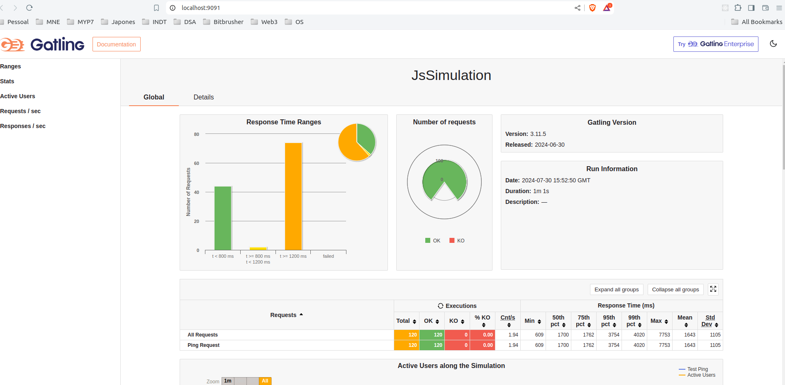

# My Gatling Template with JS SDK

This project demonstrates a Gatling example using the JavaScript SDK. It includes a Docker configuration that runs a server in JavaScript to expose the result dashboard of the Gatling process.



## Table of Contents
- [Introduction](#introduction)
- [Prerequisites](#prerequisites)
- [Installation](#installation)
- [Running the Project](#running-the-project)
- [Accessing the Dashboard](#accessing-the-dashboard)
- [Project Structure](#project-structure)
- [Contributing](#contributing)
- [License](#license)

## Introduction
This project is designed to provide an example of using Gatling, a load testing tool, with the JavaScript SDK. The project includes a Docker configuration that sets up and runs a server to host the result dashboard of the Gatling process, making it easy to access and analyze the performance test results.

## Prerequisites
Before you begin, ensure you have met the following requirements:
- Docker installed on your machine
- Basic knowledge of JavaScript and Gatling

## Installation
1. Clone the repository:
    ```bash
    git clone https://github.com/lucasbalieiro/gatling_docker_server.git
    cd gatling-docker-server
    ```

## Running the Project
1. Start the Docker container:
    ```bash
    docker compose up --build
    ```

2. The Gatling process will run and generate performance test results.

## Accessing the Dashboard
1. Open your web browser and navigate to `http://localhost:9091`.
2. You should see the Gatling result dashboard, where you can view and analyze the performance test results.

## Project Structure
```
.
├── docker-compose.yaml
├── Dockerfile
├── image.png
├── package.json
├── package-lock.json
├── readme.md
├── server.js
└── src
    └── example.gatling.js
```

- **docker-compose.yaml**: Defines the Docker services configuration.
- **Dockerfile**: Defines the Docker image configuration.
- **image.png**: An image used in the README.
- **package.json**: Dependencies for the server application.
- **package-lock.json**: Lock file for the dependencies.
- **readme.md**: The README file.
- **server.js**: Main server application file.
- **src/example.gatling.js**: Contains the Gatling simulation script.

## Contributing
Contributions are welcome! Please open an issue or submit a pull request for any changes.
